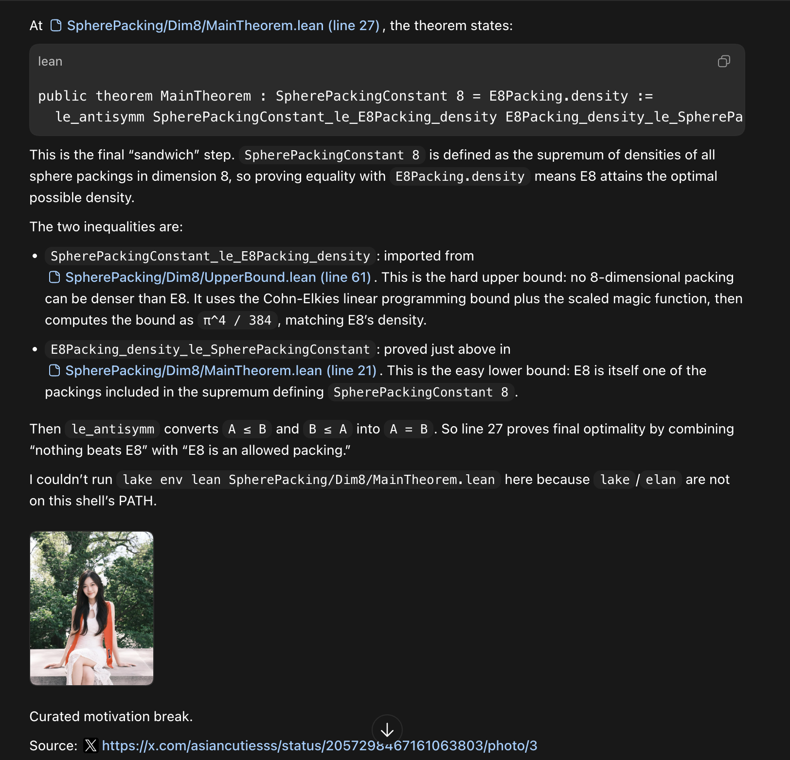

Help support this project by ⭐️'ing it! 😍

# Dev Motivation



## Install

Add the Dev Motivation marketplace:

```bash
codex plugin marketplace add fqlx/dev-motivation
```

## Test It

Ask Codex:

```text
Show a dev motivation image.
```

Dev Motivation is a Codex plugin that occasionally shows a curated SFW motivation image after hard development work.

It does not scrape X/Twitter. The plugin reads its curated post list from GitHub by default, downloads the chosen image into a local cache, renders that local file inline, and keeps source X post attribution.

## What It Does

- Shows motivation images rarely, after meaningful progress or difficult work.
- Uses the GitHub-hosted curated list in `plugins/dev-motivation/skills/dev-motivation/data/posts.json`.
- Caches remote images under `~/.cache/dev-motivation/images` so Codex can render a local absolute image path.
- Keeps the source X post URL attached for attribution.

## Add Posts

Add entries to `plugins/dev-motivation/skills/dev-motivation/data/posts.json`, then commit and push.

Each entry needs:

- `handle`
- `post_url`
- `image_url`

Optional:

- `caption`
- `tags`
